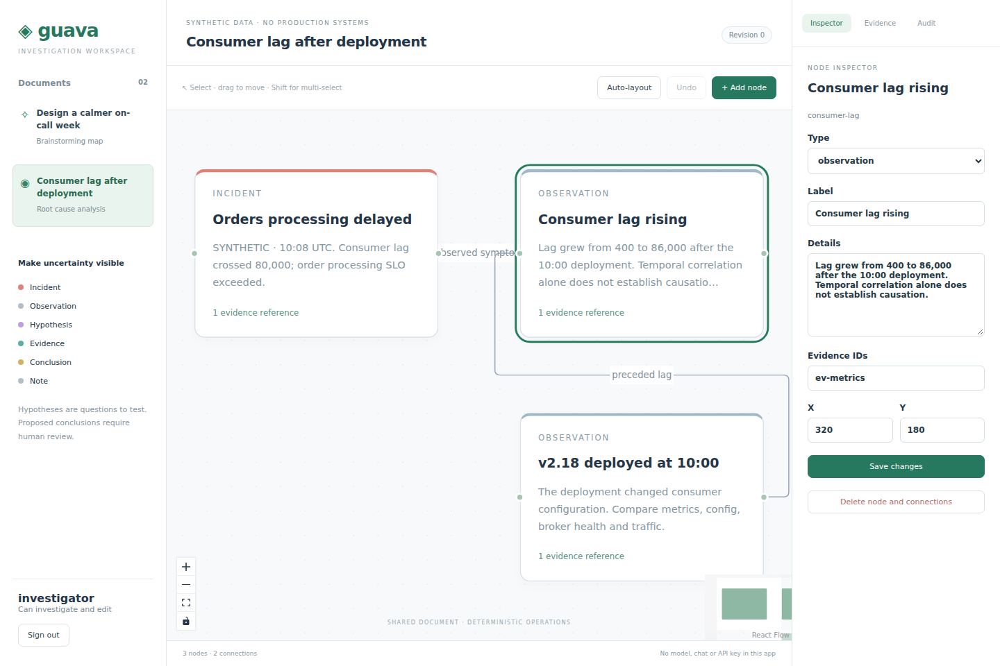
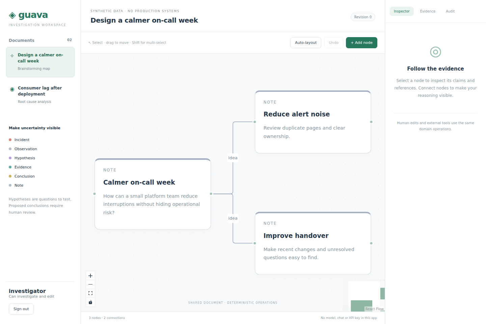
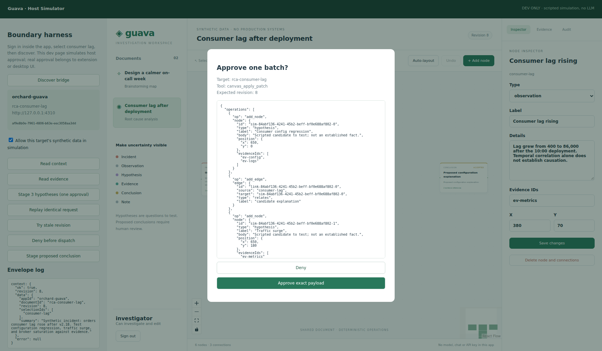

# Guava — Investigation Canvas

Runnable app in `orchad/guava`. Synthetic RCA and brainstorming share the same React/XYFlow bundle, Fastify backend and Agent App Bridge 0.1. No chat UI, LLM SDK, model integration, API key or agent loop.

## Run locally

Requires Node 24 or newer; SQLite uses the built-in `node:sqlite` driver.

1. From `guava`, run `npm ci`.
2. Run `npm run dev`.
3. Open http://127.0.0.1:4310. Use this exact origin; login rejects other origins by design.
4. Sign in using the explicitly development-only accounts below.
5. For the independent dev harness, open http://127.0.0.1:4310/harness/index.html.

| Account | Password | Backend permissions |
| --- | --- | --- |
| investigator | investigator-dev | Read, mutate graph, propose conclusion, explicitly accept as human |
| reader | reader-dev | Read only; server rejects mutations even with modified UI or bridge |

The accounts and data are synthetic development fixtures, not a production identity system. Both accounts can access the two seeded documents. The backend additionally checks document ACLs and evidence membership on each operation.

Production app: `npm run build`, then `npm start`. Fastify serves `dist` and `/api` at the same origin. The dev harness and native adapter are not included in the production frontend entry point. No public deployment is included.

| Environment | Default | Meaning |
| --- | --- | --- |
| PORT | 4310 | Same-origin server port, development or production |
| HOST | 127.0.0.1 | Bind address; Docker overrides to 0.0.0.0 |
| APP_ORIGIN | http://127.0.0.1:PORT | Exact accepted Origin for state-changing requests |
| DATABASE_PATH | .data/guava.sqlite | SQLite file; startup applies idempotent migration and seed |
| COOKIE_SECURE | false | Set true with HTTPS APP_ORIGIN for Secure, HttpOnly, Strict, __Host cookie |

To run the packaged app, build the `Dockerfile`, map port 4310 and persist `/data`. Set APP_ORIGIN to the exact URL used by the browser. Terminate HTTPS at the deployment boundary and set COOKIE_SECURE=true for HTTPS. Docker build was not run in this workspace.

## Human workflow

Select the RCA document and Consumer lag rising. Shift-select supports multiple nodes; drag the canvas to pan and use wheel/controls to zoom. Add a node, edit labels/details/evidence references/coordinates in the inspector, and connect output/input handles. Clicking an edge opens its label and relates/supports/contradicts editor. Auto-layout is deterministic by node type and stable ID. Selection does not change the document revision.

All persisted edits go through the same application controller, HTTP API and domain service used by the bridge. Temporary React drag/selection state is presentation only. Three-second polling reconciles changes from other app windows; this is not a CRDT or websocket collaborative editor. Stale edits are rejected rather than merged.

Undo operates on an explicit mutation ID and the latest document revision. The toolbar tracks the last mutation acknowledged in this page. Reload loses that toolbar pointer, but `canvas_undo` can still use a known persisted mutation ID. Undo restores a SQLite document snapshot, adds a revision and is itself replay-safe. It does not undo external effects or bypass intervening edits.

Hypotheses remain hypotheses. `investigation_propose_conclusion` creates an immutable proposed claim with supporting and contradictory references. Only the separate human inspector action accepts that conclusion. Acceptance records human acknowledgement; it is not automated proof of truth. Graph tools cannot create accepted conclusions, rewrite conclusion content, or delete or undo an accepted conclusion. Positions can still change.

## Seeded data

`src/server/seed.ts` contains two documents and seven synthetic RCA records: incident summary, deployment timeline, configuration diff, throughput/input snapshots, broker metrics, sampled logs and a transient rebalance. The configuration hypothesis has supporting signals; steady input and healthy brokers weaken alternatives; the transient rebalance offers a competing deployment effect. No root-cause button or hardcoded authoritative conclusion exists.

All UI documents are labeled synthetic. Evidence IDs, timestamps and source metadata are stable. Records are scoped to their document; brainstorming does not inherit the RCA document's evidence permissions.

## Bridge and tools

`src/shared/contract.ts` contains the snapshot types. `src/shared/catalog.ts` is the shared bounded JSON Schema registry. `src/client/bridge.ts` installs exactly `window.agentBridgeV1.describe`, `getContext`, and `invoke`. `getContext` returns only app ID, active document ID/revision, selection IDs and a short summary. It rechecks the authenticated session and reloads current document state; cookies/CSRF values are not returned through the bridge.

Read invocations require expectedRevision=null and idempotencyKey=null. Writes require both a nonnegative expectedRevision and nonempty key. See [TOOL-CATALOG.md](TOOL-CATALOG.md) for schemas, operation shapes and examples. There is no tool that accesses arbitrary URL, SQL, JavaScript, filesystem, identity or host policy.

The page bridge is not an MCP server. Production host consent/approval belongs to Lime or Coconut. A page cannot prove host approval; Guava does not trust any agent-supplied approved/userId/role field. Its backend independently enforces application permissions and integrity.

### Optional native WebMCP

`src/client/native-webmcp.ts` is an optional adapter against the documented draft `document.modelContext.registerTool` API. It consumes this same registry, wraps tool arguments with document/revision/idempotency binding, and requires a dispatch callback supplied by a verified host. That callback owns consent, policy and approval; it must not directly bypass the trusted host. AbortSignal unregisters the adapter. No `navigator.modelContext` polyfill is installed.

It is intentionally not auto-enabled in the app entry point. Stable browsers and embedded engines use Agent App Bridge 0.1. Native adapter tests are mock-only; no native WebMCP runtime or approval path is claimed tested. Documentation consulted: https://developer.chrome.com/docs/ai/webmcp/imperative-api (updated September 21, 2026).

## Scripted host simulator

The dev-only `harness` is a separate Vite HTML entry point with the label **scripted simulation, no LLM**. It embeds the real app at the same origin for development, discovers the actual bridge and pins a generated target/page-instance binding. Sign in inside the app first.

1. Select consumer lag, click Discover bridge, grant simulation consent, then Read context and Read evidence.
2. Stage 3 hypotheses. Review the exact batch in the approval dialog; approve once to add all three nodes and edges in one SQLite transaction.
3. Replay identical request: result is replayed, graph stays unchanged.
4. Try stale revision: backend returns STALE_CONTEXT.
5. Deny before dispatch: host produces APPROVAL_DENIED, page is not invoked.
6. Read fresh context before proposing a conclusion or staging another batch. Use the app inspector to accept as human, edit a hypothesis, or undo the last mutation.
7. Change document or sign out: the old simulator pin fails closed. Rediscover and consent to the new target.

The simulator implements an explicit policy allowlist, consent, session/document binding, exact approval payload binding, 60-second expiry and post-approval revalidation. It is a test harness in the page origin, not a real trusted browser/native host, not a chatbot, and not proof of model reasoning. It never sends data to a model.

`harness/fixture.ts` is the clearly labeled demo-counter test double, including value 0 / revision 0, approved increment, deduplication, key conflict and stale revision. Contract tests also cover an unsupported page with no bridge.

## Tests

- `npm test`: database-backed backend tests, two-worker SQLite race test, shared counter contract tests, host simulator tests and mock native adapter tests.
- `npm run typecheck`: strict TypeScript checks.
- `npm run build`: production frontend build and typecheck.
- `npx playwright install chromium`, then `npm run test:e2e`: real browser UI, bridge and dev-harness scenarios. Each run uses its own SQLite file. Screenshots are written to `screenshots`.
- `npm run test:production`: build, then real browser test against Fastify serving production assets; checks bridge, persistence and harness exclusion.
- `npm run test:integration`: optional official MCP SDK client connecting to external host artifacts. Missing URLs/tokens print NOT RUN, not PASS. See [INTEGRATION-CHECKLIST.md](INTEGRATION-CHECKLIST.md).

When Chromium is already installed, set CHROMIUM_PATH to its executable. This workspace used a real Chromium 153.0.8010.0 binary from the @sparticuz/chromium 153.0.0 npm distribution because the normal Playwright CDN returned truncated files. No browser binary is committed.

## Structure and references

- `src/server`: HTTP/auth boundary, domain service, SQLite lifecycle and deterministic seeds.
- `src/shared`: contract, graph types, layout and tool schemas.
- `src/client`: human UI, application controller and small bridge adapters.
- `harness`: independent dev simulator and interoperability test double.
- `migrations/001.sql`: accounts, sessions, ACLs, documents, evidence, idempotency, undo history and audit.
- `tests`: automated tests against real database and browser.
- `scripts/integration.ts`: configured external host SDK client, never modifies host repositories.

Read [SECURITY.md](SECURITY.md), [IMPLEMENTATION-REPORT.md](IMPLEMENTATION-REPORT.md) and [CONTRACT-CHANGES.md](CONTRACT-CHANGES.md) for boundaries and limitations. Dependencies are exactly pinned with a committed lockfile. Versions were resolved from npm and APIs checked against official Fastify/React Flow documentation.

