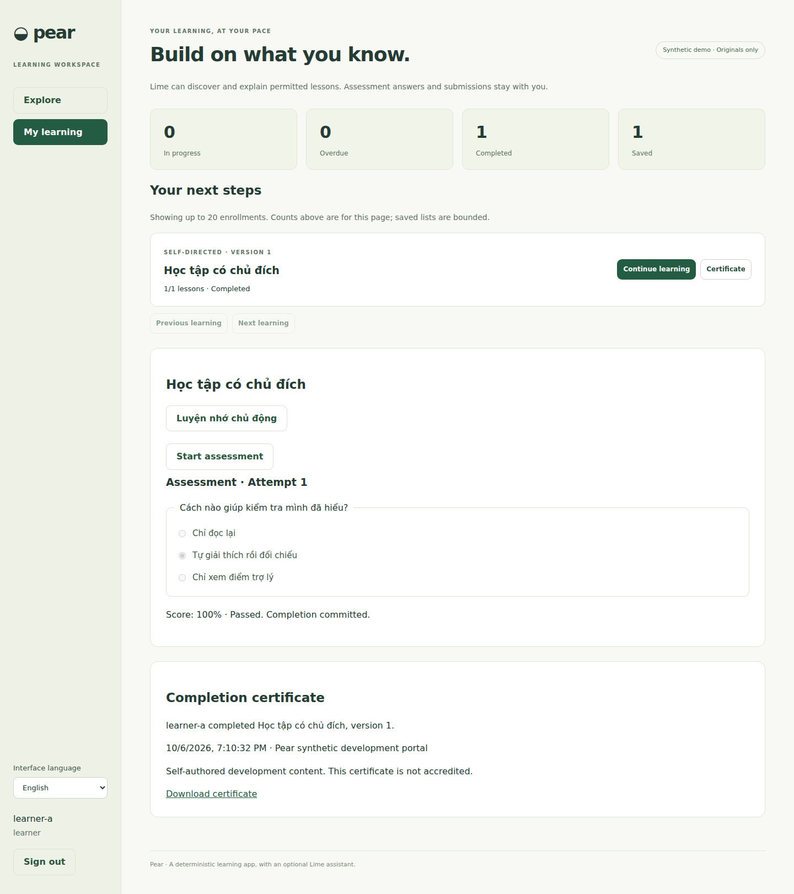
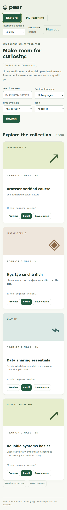

# Pear

SCORM engine expansion is tracked in epic #133 and [ADR-075](docs/ADR-075-scorm-engine-foundation.md). Multi-file import/review is in [ADR-076](docs/ADR-076-scorm-multifile-packages.md), durable isolated playback in [ADR-077](docs/ADR-077-scorm12-durable-player.md), multi-SCO 1.2/enrollment evidence/retakes in [ADR-078](docs/ADR-078-scorm-learning-bindings.md), and edition-aware SCORM 2004 runtime in [ADR-079](docs/ADR-079-scorm2004-runtime.md), with trusted multi-SCO sequencing in [ADR-080](docs/ADR-080-scorm2004-trusted-sequencing.md) and licensed wrapper/browser isolation evidence in [ADR-081](docs/ADR-081-scorm-wrapper-interop-and-browser-isolation.md). Build first, then run `PEAR_SCORM_CONTENT_ORIGIN=http://localhost:4315 npm run dev` with Pear at `http://127.0.0.1:4314`. Both loopback hosts share SQLite; content requires a different hostname, not merely a different port. Practice/preview stays unofficial. Published SCORM lesson/item policies can project accepted evidence into exact enrollments; courses still require their quiz. `npm run test:scorm:browser` owns its app ports. See [support matrix](docs/SCORM-SUPPORT-MATRIX.md) and [operations/recovery](docs/SCORM-OPERATIONS.md) for edition coverage, scoped diagnostics, quotas, backup/restore and platform gates. Full standards/external-tool acceptance and production/native isolation remain open gates. The independent foundation host command still serves health only.

Independent deterministic learning app for [epic #49](https://github.com/and1truong/orchad/issues/49), built with React/TypeScript, same-origin Fastify and Node 24 SQLite. Full Go1 parity remains open; [capability register](docs/CAPABILITIES.md) separates implemented internal profiles, CI evidence, unfinished work and external dependencies.

Pear owns catalog, immutable learning versions, roles, official grades/completion, reports and administration. Lime/shared Pi/Mango owns model execution. Pear contains no model, provider credentials or app-owned agent loop.

## Run
From the repository root:

```bash
npm --prefix packages/bridge-contract ci
npm --prefix pear ci
npm --prefix pear run dev
```

Open http://127.0.0.1:4314. One process serves Vite and API. SQLite defaults to `.data/pear.sqlite`, with migrations and idempotent synthetic seeds. Guava uses 4310, Mango 4311 and Lime fixtures 4313.

Original self-authored course fixtures and accounts require no subscription/provider key. Accounts are learner-a, learner-b, manager, admin, editor and assessor; password is the account name followed by `-dev`. Manager has only learner-a as a direct report. The outsider tenant exists for negative tests. The original security course withholds model-processing permission.

Learners can discover/compare/save/enroll, continue pinned prerequisites, submit their own official assessments, track standalone reading, review awards/evidence, download authorized transcripts/certificates, choose interface/content language read an explicitly requested own digest and review an opt-in own in-app schedule with retention controls. Administration covers authoring/publication/unpublish/retirement, scoped users/groups/assignments/reports, delegated assessment and human-reviewed integration settings.

## Build and configuration
`npm run build` typechecks and creates `dist`; `npm start` serves built assets/API. Normal mode has no synthetic seed/login. Reviewed OIDC configuration supports the implemented signed Authorization Code/PKCE/subject-mapping profile; real provider and production deployment are not verified. Without a configured login method, authentication stays closed.

An explicit loopback built demo uses `PEAR_DEVELOPMENT_AUTH=true npm start`. Synthetic login requires both loopback bind host and origin. `PORT` defaults to 4314, `HOST` to 127.0.0.1, `APP_ORIGIN` must be the exact origin, `DATABASE_PATH` selects storage, and `COOKIE_SECURE=true` requires HTTPS. Node 24+ and the exact-pinned lockfiles are required.

`PEAR_OIDC_CONFIG` supplies reviewed server JSON. `PEAR_SCIM_ENABLED=true` enables the restricted client-owned User/static Group profile. `PEAR_XAPI_ENABLED=true` additionally requires SCIM and enables the restricted xAPI profile. `PEAR_WEBHOOK_ENDPOINTS` supplies pinned reviewed server endpoints. Identity/provisioning/xAPI/webhook production configuration requires secure cookies/HTTPS; these variables alone do not verify a provider, recipient or deployment. `PEAR_CATALOG_ADAPTERS` supplies exact trusted metadata-provider/client/license/processing/HTTPS destination configuration (ADR-043–045); it does not enable a provider until a same-owner tenant-admin reviews it. Catalog-only credential issuance does not expose SCIM, and newly issued clients need trusted binding and a fresh review. Detailed identity/channel configuration is in ADR-021/022/023/025.

Binary uploads and the SCORM sandbox profile remain subject to explicit development/identity-fixture gates and production scanning/storage policy. The inline SCORM profile is `pear-scorm12-inline/1`, not general SCORM/LRS conformance. Its reported CMI activity stays separate from official course completion.

## Test lanes
- `npm test`: deterministic domain/SQLite, migration and real HTTP/security regressions. No model or paid provider.
- `npm run typecheck` / `npm run build`: independent production source checks.
- `npm run test:e2e`: human/admin/responsive browser journeys. Install Chromium with `npx playwright install chromium`.
- `npm run test:production`: build plus the same journeys against built assets with explicit synthetic loopback fixtures.
- After Mango/Lime dependencies and builds: `npm run typecheck:host`, `npm run test:host`, `npm run test:browser-host`: actual HostPolicy/shared Pi/Pear tests with labelled scripted gateway and transport/approval fixtures.
- `npm run test:lime`: actual unpacked Lime extension-page UI, actual MAIN-world bridge and Pear HTTP/SQLite, with scripted Mango. Browser/extension startup failure fails the lane; native Chrome Side Panel container and inference quality are separate.
- The Coconut CI lane runs actual Tauri Pear WebView and a real external client over the Coconut MCP facade, alongside the native counter acceptance lane.
- The shared `packages/agent-durable` lane installs Pear/Lime dependencies and tests actual shared Pi durable scheduling → scripted real Mango → actual HostPolicy → actual Pear HTTP/SQLite under lost-response/recovery/revocation fault injection.

`CHROMIUM_PATH` selects a compatible browser executable. `CHROMIUM_EXTRA_ARGS` is a JSON array for the extension harness. CI uploads actual screenshots/traces/reports; artifact files are evidence for their exact run, not a blanket parity claim. Host-only tests have a separate TypeScript configuration and are not production Pear imports.

## Data and integrity boundaries
Published versions and existing enrollment pins are immutable. Unpublish withdraws new discovery/enrollment/publication references without rewriting pinned learning; republish advances version. Original course/item/collection/bank tenant, author and bounded group audiences are implemented. Current static/dynamic membership gates pinned group activities and media without deleting official history. Reuse cannot widen declared source audiences; staff banks never expose answer keys to learners. Cross-portal/license sharing and exact reference policies remain open.

Host mutation approval cannot select/save/submit official answers, acknowledge lessons, confirm reading/evidence, grade work or mark attendance. Those operations require the human controller and live server authorization. Keys and private evidence/files stay outside model reads. Source metadata/text/tool results are untrusted data; content licenses can withhold model processing even when human reading is authorized.

Intended duration, observed server timer intervals, reported xAPI/SCORM activity, optional AI practice and official grade/completion are distinct. Optional practice is unofficial and skippable; scripted transport tests do not establish question quality. An own on-demand digest is bounded and private. A separately reviewed in-app schedule defaults off and emits only own metadata notifications, with live group checks at generation/read, occurrence dedup, six-hour late tolerance, three-per-24h cap and 1–30-day payload retention. The startup process runs an independent 30-second deterministic job; it sends no email/Slack/Teams/calendar event and changes no official learning. Changed account authority requires a new review. Human read/delete controls are private; audit/preferences/original-key receipts have separate operational retention (ADR-048).

Bridge 0.1 stays canonical and byte-identical, with 64 KiB messages, bounded complete domain catalogs and whole-row pagination. Course content is bounded to 44 KiB. Binary routes have separate upload/quota limits. No arbitrary DOM/SQL/JS/fetch/admin proxy is exposed.

## Delivery and remaining scope
The delivery stack is #59–#132 (73 PRs). ADR-074/migration 042 integrates the three award/course gaps on the existing final branch. Runtime source `05d0bf4` passed clean all-eight CI and 369 domain / 65 dev / 65 built / 2 host-browser checks. Merge foundation upward using merge commits, retaining incremental diffs and original ancestry; the live merge ledger is epic #49. The merge/evidence record is in [DELIVERY-EVIDENCE.md](docs/DELIVERY-EVIDENCE.md). Exact-head outcomes and historical failures are recorded in the [capability register](docs/CAPABILITIES.md); earlier implementation reports/screenshots are historical evidence.

Production media scanning/storage/retention, licensed provider catalog/entitlements/translations, actual identity/partner/channel integrations and deployment require separate verified dependencies. Internal live audiences, human-reviewed retakes/events, own insight definitions, typed Lime workflows and durable guidance/admission are implemented under bounded policies. Exact reference reset/recertification/full metrics, evaluated inference usefulness and manual accessibility/linguistic audits remain open. Synthetic certificates are not accredited. Browser Print/Save PDF and authenticated original server PDFs for course/award certificates, own transcripts and scoped reports are implemented (#118/#123/#124). Their bounded Latin/Vietnamese/font profile does not establish PDF/A, tagged-PDF accessibility or accreditation.

See [current gap table and full-parity milestones](docs/DELIVERY-STATUS.md). Exact nested course pins, completed-course requalification and award-cycle child migration use the human-reviewed binding in ADR-074; original history, cycle and future pins are preserved.

See ADR-001–074 for each bounded policy/profile and its remaining limits. No scope exception, automatic epic closure or production release is implied.

## Observed baseline UI
Original browser fixtures:






### Reviewed SSO invitations

With the existing secure OIDC configuration, an administrator can create users
in People and review one-time exact-subject invitations under Administration.
An invitation link requires the reviewed SSO identity; it is not a password or
bearer login. Default expiry is one day; admins explicitly choose 1–30 days.
Revoke/reissue when the identity, authority or expiry changes. Acceptance preserves
all learning records and roles.

Optional server-only `PEAR_INVITATION_MAIL` JSON config selects a reviewed HTTPS
mail relay (`url`, `token`); it receives `recipient`, `url`, `expiresAt` JSON, Bearer
auth and a stable invitation-ID idempotency header. The relay must deduplicate
retries. Configure credentials at the trusted server boundary. The human must
confirm each send; absent configuration sends nothing. HTTP acceptance is not
mailbox delivery. Bulk/automatic welcome email and password onboarding remain
open. See [ADR-103](docs/ADR-103-reviewed-sso-invitations.md).

Focused checks: `node --import tsx --test tests/invitations.test.ts tests/identity.test.ts`
and, after `npm run build`, `PEAR_E2E_PRODUCTION=1 npm run test:e2e -- invitations.spec.ts identity.spec.ts`.
